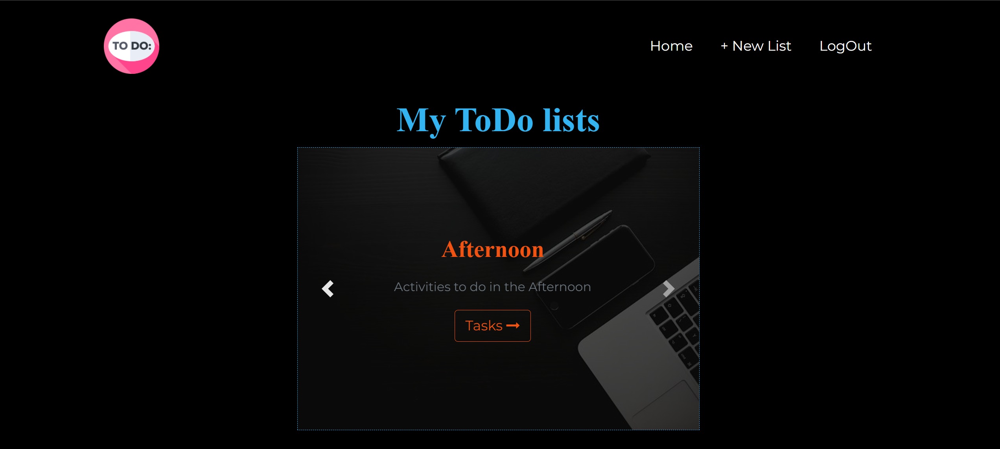

# ToDo List Application with Flask

This is a fully functional ToDo app with flask.
## It supports:
* Creating a Todo
* Adding Tasks to ToDo.
* Checking out completed tasks.
* User registration.
* User Login/Logout.

**Note:** The app is not optimized for mobile yet. 
That's something I will be working on in the future.

Check it out:

What do you think?